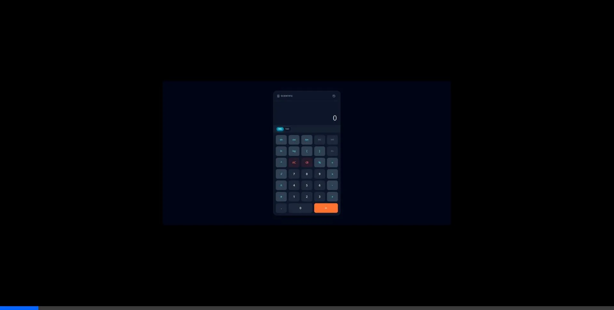

# Scientific Calculator (HTML/JS)

A modern, responsive scientific calculator built with vanilla JavaScript and Tailwind CSS.



## Features

- **Scientific Operations**: Support for Trigonometry (sin, cos, tan), Logarithms (log, ln), Powers (^), Roots (√), and constants (π, e).
- **Degree & Radian Modes**: Easily toggle between Degree (DEG) and Radian (RAD) modes for trigonometric calculations.
- **Calculation History**: Automatically saves your recent calculations. Click on any history item to load the result back into the display.
- **Memory Functions**: Standard memory controls including Memory Clear (MC), Memory Recall (MR), Memory Add (M+), and Memory Subtract (M-).
- **Modern UI**: A sleek, dark-themed interface designed with Tailwind CSS, featuring glassmorphism effects and responsive layout for mobile and desktop.
- **Error Handling**: Graceful handling of mathematical errors (e.g., division by zero).

## Technologies Used

- **HTML5**: Provides the semantic structure of the application.
- **Tailwind CSS**: Used for rapid, utility-first styling to create a beautiful and responsive design.
- **JavaScript (ES6+)**: Handles all the calculator logic, DOM manipulation, and state management.

## Getting Started

### Prerequisites

You only need a modern web browser to run this project.

### Installation

1.  **Clone the repository** (if applicable) or download the source code.
2.  **Open the project**:
    -   Simply double-click `index.html` to open it in your browser.
    -   **OR** run a local server for a better experience:
        ```bash
        # Python 3
        python3 -m http.server
        ```
        Then navigate to `http://localhost:8000` in your browser.

## Project Structure

```text
.
├── index.html      # Main HTML file with UI structure
├── js/
│   └── script.js   # JavaScript file with calculator logic
└── README.md       # Project documentation
```

## Usage

1.  **Basic Math**: Use the number pad and operators (+, -, *, /) for standard calculations.
2.  **Scientific Math**: Use the function buttons on the left side (sin, cos, log, etc.).
3.  **History**: Click the "History" icon (clock) in the top right to view past calculations.
4.  **Clear**: Press `AC` to clear everything or the backspace icon to delete the last character.

## License

This project is open source and available for personal and educational use.
